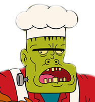

# :chart_with_upwards_trend:chefrank

>View your Institute's Monthly Ranking's on [codechef.com](http://codechef.com) using [rhnvrm/codechef-api-bouncer](http://github.com/rhnvrm/codechef-api-bouncer).

